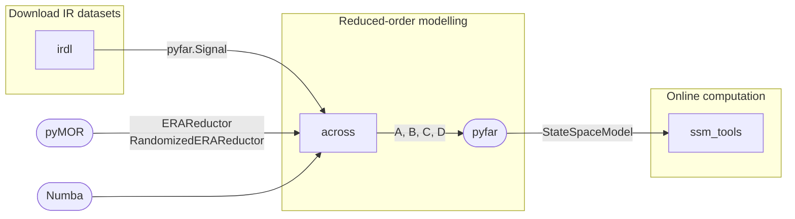

# State-space System Modelling Tools

A collection of interoperable Python packages for working with state-space models in acoustics.

Any discrete-time LTI system can be formulated in state-space. The system's action from input $u$ to output $y$ is governed by the so-called state equations:

$$
\begin{aligned}
\mathbf{x}[k+1] &= \mathbf{A}\mathbf{x}[k] + \mathbf{B}\mathbf{u}[k] \\
\mathbf{y}[k] &= \mathbf{C}\mathbf{x}[k] + \mathbf{D}\mathbf{u}[k]
\end{aligned}
$$

## Ecosystem

We combine multiple packages to make it easy to generate state-space models from impulse response data.

| Package | Description |
|---------|-------------|
| [`irdl`](https://artpelling.github.io/irdl/) | Downloads and processes impulse response datasets |
| [`across`](packages/across/README.md) | Reduced-order state-space models from impulse response data via ERA |
| [`ssm_tools`](pyproject.toml) | Efficient solvers for time-domain simulation of state-space models |

### Workflow


---

# The `ssm_tools` Python package

It implements [`pyfar`](https://pyfar.org)-compatible state-space model classes with interchangeable solver backends. They are written in Rust and use BLAS.

### Solver backends

| Class | Backend | dtypes | Status |
|-------|---------|--------|--------|
| `pyfar.StateSpaceModel` | NumPy | float32, float64 | baseline |
| `StateSpaceModel` | Rust + BLAS (CBLAS `gemv`) | float32, float64 | available |
| `TriangularStateSpaceModel` | — | — | planned |
| `DiagonalStateSpaceModel` | — | — | planned |

All classes accept a `storage` parameter (`'F'` column-major or `'C'` row-major) that controls the memory layout of the system matrices. The system state `x` is updated in place across calls, so sequential chunk processing preserves state.

### Installation

Add to your `pyproject.toml`:

```toml
dependencies = [
    "ssm_tools @ git+https://github.com/artpelling/ssm-tools"
]
```

or install directly:

```sh
pip install git+https://github.com/artpelling/ssm-tools
```

> **Note:** `ssm_tools` contains a Rust extension that requires an LP64 CBLAS library at build time. On most systems this is resolved automatically. See [BLAS.md](BLAS.md) for details.

### Quick start

```python
import numpy as np
from pyfar import Signal
from ssm_tools.models import StateSpaceModel

# Build a system (n states, m inputs, p outputs)
A, B, C = np.eye(100) * 0.9, np.random.randn(100, 2), np.random.randn(4, 100)
sys = StateSpaceModel(A, B, C, sampling_rate=44100, dtype=np.float32)
sys.init_state()

# Process a signal — returns a pyfar.Signal
sig = Signal(np.random.randn(2, 4096), sampling_rate=44100)
out = sys.process(sig)
```

### Development setup

The Rust extension is built with [maturin](https://github.com/PyO3/maturin), managed via [uv](https://docs.astral.sh/uv/):

```sh
git clone https://github.com/artpelling/ssm-tools
cd ssm-tools
uv sync
uv run maturin develop --release
```
