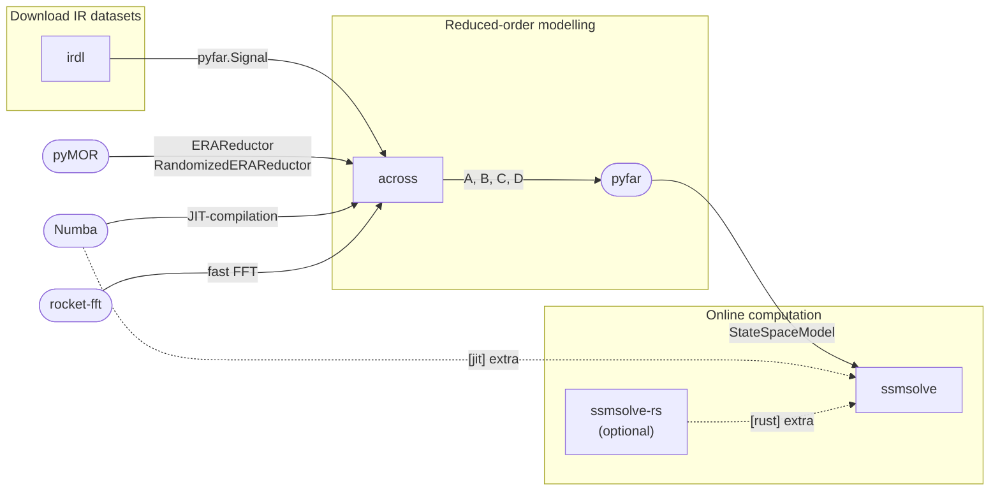

# State-space System Modelling Tools

A collection of interoperable Python packages for working with state-space models in acoustics.

Any discrete-time LTI system can be formulated in state-space. The system's action from input $u$ to output $y$ is governed by the so-called state equations:

$$
\begin{aligned}
\mathbf{x}[k+1] &= \mathbf{A}\mathbf{x}[k] + \mathbf{B}\mathbf{u}[k] \\
\mathbf{y}[k] &= \mathbf{C}\mathbf{x}[k] + \mathbf{D}\mathbf{u}[k]
\end{aligned}
$$

## Ecosystem

| Package | Description |
|---------|-------------|
| [`irdl`](https://artpelling.github.io/irdl/) | Downloads and processes impulse response datasets |
| [`across`](packages/across/) | Reduced-order state-space models from impulse response data via ERA |
| [`ssmsolve`](packages/ssmsolve/) | Python state-space model classes with pluggable solver backends |
| [`ssmsolve-rs`](packages/ssmsolve-rs/) | BLAS-accelerated Rust solvers for discrete-time state-space recursion |

### Workflow

